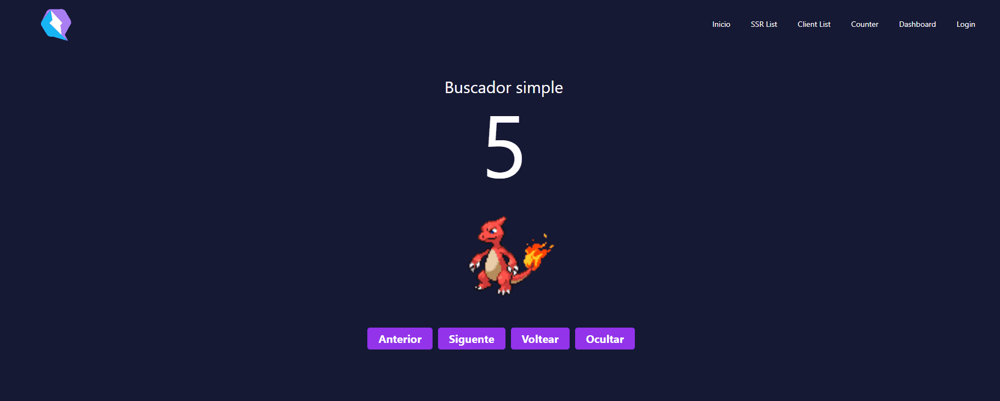
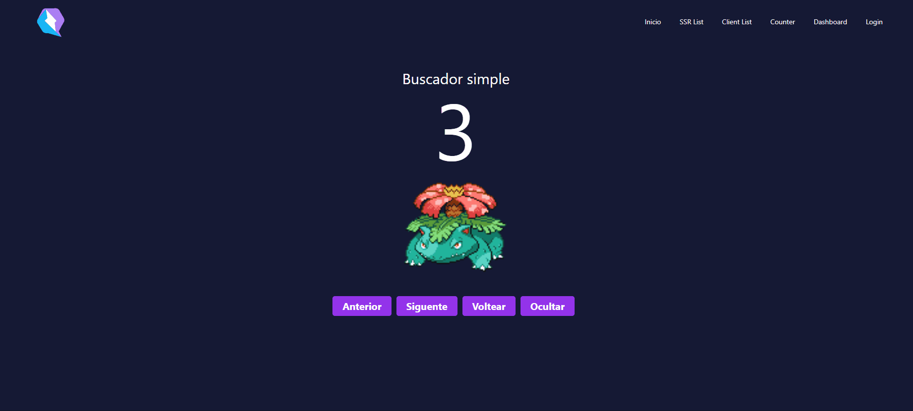

# PokeQwik

Practicas del curso de [introducción a Qwik](https://cursos.devtalles.com/courses/take/qwik-introduccion) de Fernando Herrera en [devtalles](https://cursos.devtalles.com/)

- [Documentación oficial sobre Qwik](https://qwik.builder.io/docs/getting-started/)
- [Presentaciones, videos y podcast](https://qwik.builder.io/media/)

## Puesta en marcha

### Configuración de ENVs

Renombrar el archivo __.env.template__ a __.env__ y completar las variabes de entorno

### Express Server

This app has a minimal [Express server](https://expressjs.com/) implementation. After running a full build, you can preview the build using the command:

```bash
npm run serve
```

Then visit [http://localhost:8080/](http://localhost:8080/)

---

## Features

- Tailwind
- Signals, useTask, useVisibleTask, custom hooks, slots..
- Rutas personalizadas, publicas y privadas
- Gestión de estados
- Layouts personalizados
- ...

---

## Screenshot

### infinite scroll


### Control de estado



### Rutas protegidas

